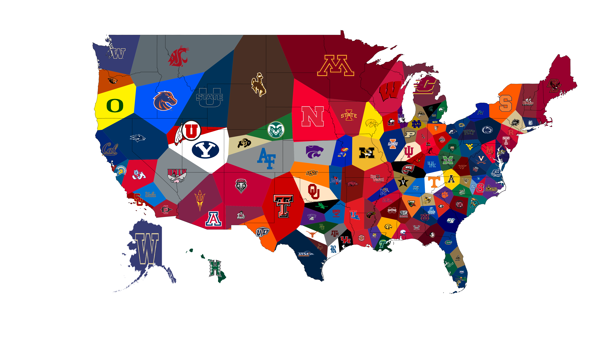

# FBS Voronoi
<html>
  <head>
    Regions of the US based on how close you are to the nearest FBS football stadium
  </head>
  <body>
    

      Created using geopandas library for the mapping, and scipy for the Voronoi diagram (https://en.wikipedia.org/wiki/Voronoi_diagram)
    

    
  </body>
</html>
